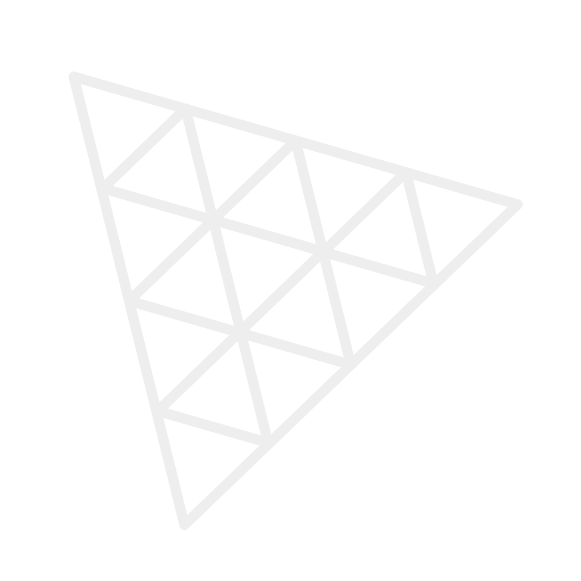

#  Three.js FPS Game Template – Open Source

### A Classic FPS Rig with Shooting, Movement, & Physics

A fully modular Three.js game template demonstrating FPS-style movement, physics, shooting mechanics, and background music. This project is an updated and expanded version of the original [Three.js FPS example](https://threejs.org/examples/?q=FPS#games_fps), with additional features, modular architecture, and optimizations to enhance flexibility and maintainability.

This project builds upon the foundations of the original example while introducing improvements like sound effects, a camera attached to the rig, and animations synced with actions like shooting and idle to create a more immersive FPS experience.

## **🔑 Key Features**

✅ Three.js – High-performance 3D rendering
✅ GLTFLoader – Efficient 3D model loading
✅ Octree Physics – Smooth collision detection & movement
✅ Modular Architecture – Clean, scalable, and easy to maintain
✅ Sound & Music Integration – Immersive SFX & ambient audio

🎯 Ideal for: Game developers, 3D enthusiasts, and anyone exploring browser-based FPS mechanics.

---

## **🎨 3D Model Credits**

**"FPS Rig AKM"** by **J-Toastie** [CC-BY] via **Poly Pizza**


---

## **⚡ Installation & Setup**

Get started with this project in a few simple steps:

### **1️⃣ Clone the Repository**

```sh
git clone https://github.com/Footprintarts/ThreeJS_FPS_2.0.git
```

### **2️⃣ Navigate to the Project Directory**

```sh
cd your-project
```

### **3️⃣ Install Dependencies**

```sh
npm install
```

### **4️⃣ Start the Development Server**

```sh
npm run dev
```

This will launch the project in your default web browser.

---

## **🎯 Features & Functionality**

### **🛠 3D Model & Animation System**

- **GLTF Model Loader**: Loads FPS rig & animations
- **Animation Mixer**: Plays shooting & reloading animations
- **Smooth Camera Handling**

### **🎮 First-Person Controls**

- **WASD for Movement**
- **Mouse Look** (Pointer Lock API)
- **Space to Jump**
- **Left Click to Shoot**

### **💥 Shooting & Physics**

- **Throwing Spheres with Realistic Collisions**
- **Octree-Based Physics** (No rigid body physics engine required)
- **Player-to-Ball Collision** (Balls bounce, player remains stable)

### **🎵 Audio System**

- **Gunfire & Reloading Sounds**
- **Ambient Background Music**

---

## **📜 Code Breakdown**

### **🔹 1. Attaching the Camera with Animated Model**

Handles **camera positioning, animations, and interactions**.

```js
import { PerspectiveCamera, Object3D, AnimationMixer } from "three";
import { GLTFLoader } from "three/examples/jsm/loaders/GLTFLoader.js";

let gunMixer = null; // Global mixer for animations
let animations = {}; // Store animations

function createCamera(scene) {
  const camera = new PerspectiveCamera(
    70,
    window.innerWidth / window.innerHeight,
    0.1,
    1000
  );
  camera.rotation.order = "YXZ";
  camera.position.set(0, 1.6, 2);

  const player = new Object3D();
  player.add(camera);

  const gunHolder = new Object3D();
  gunHolder.position.set(0, -0.2, -0.5);
  camera.add(gunHolder);

  const loader = new GLTFLoader();
  loader.load("/models/FpsRig.glb", (gltf) => {
    const gun = gltf.scene;
    gun.scale.set(0.08, 0.08, 0.08);
    gun.position.set(0, 0, 0);
    gun.rotation.set(0, Math.PI / 2, 0);
    gunHolder.add(gun);

    // Initialize Animation Mixer
    gunMixer = new AnimationMixer(gun);

    // Store animations in a dictionary
    gltf.animations.forEach((clip) => {
      animations[clip.name] = gunMixer.clipAction(clip);
    });

    console.log("Available Animations:", Object.keys(animations));

    // Play Idle by default
    playGunAnimation("Armature|Idle");

    scene.add(player);
  });

  return { camera, player, gunHolder };
}

function playGunAnimation(animationName) {
  if (gunMixer && animations[animationName]) {
    Object.values(animations).forEach((action) => action.stop()); // Stop all animations
    animations[animationName].reset().play(); // Play the desired animation
  }
}

export { createCamera, playGunAnimation, gunMixer };
```

- **EXPECTED RESULT:**
  

---

### **🔹 2. FPS Controls & Movement**

Handles **player movement, mouse look, and shooting**.

```js
import * as THREE from "three";

function setupControls(camera, playerVelocity, throwBall, playerDirection) {
  const keyStates = {};

  document.addEventListener(
    "keydown",
    (event) => (keyStates[event.code] = true)
  );
  document.addEventListener(
    "keyup",
    (event) => (keyStates[event.code] = false)
  );

  document.body.addEventListener("click", () =>
    document.body.requestPointerLock()
  );

  // ✅ Pass `playerDirection` correctly
  document.body.addEventListener("mousedown", () => {
    if (document.pointerLockElement === document.body) {
      throwBall(camera, playerDirection); // ✅ FIX: Pass playerDirection
    }
  });

  document.body.addEventListener("mousemove", (event) => {
    if (document.pointerLockElement === document.body) {
      camera.rotation.y -= event.movementX / 500;
      camera.rotation.x -= event.movementY / 500;
    }
  });

  function applyControls(deltaTime, playerOnFloor, camera) {
    const speedDelta = deltaTime * (playerOnFloor ? 25 : 8);

    // ✅ Manually update the camera's world matrix
    camera.updateMatrixWorld();

    const forward = new THREE.Vector3();
    const side = new THREE.Vector3();

    // ✅ Use matrixWorld here safely
    if (camera.matrixWorld) {
      forward.setFromMatrixColumn(camera.matrixWorld, 0);
      forward.crossVectors(camera.up, forward).normalize();

      side.setFromMatrixColumn(camera.matrixWorld, 0).normalize();
    }

    if (keyStates["KeyW"])
      playerVelocity.add(forward.clone().multiplyScalar(speedDelta));
    if (keyStates["KeyS"])
      playerVelocity.add(forward.clone().multiplyScalar(-speedDelta));
    if (keyStates["KeyA"])
      playerVelocity.add(side.clone().multiplyScalar(-speedDelta));
    if (keyStates["KeyD"])
      playerVelocity.add(side.clone().multiplyScalar(speedDelta));

    if (playerOnFloor && keyStates["Space"]) playerVelocity.y = 15;
  }

  return applyControls;
}

export { setupControls };
```

---

### **🔹 3. Shooting & Physics System**

Manages **physics-based shooting & realistic collisions**.

```js
// ⚙️💡SHOOTER CONTROLS & SOUNDS

// 🎵 **Preload Sounds**
const sounds = {
  shoot: new Audio("/sounds/laser.mp3"),
  reload: new Audio("/sounds/reload.mp3"),
};

// Reload flag to prevent shooting during reload
let isReloading = false; // Prevent shooting during reload
let isAnimationPlaying = false; // Flag to track if animation is playing

// ✅ **Play Animation + Sound**
function playAction(animationName, soundKey, autoIdle = true, idleDelay = 300) {
  if (isAnimationPlaying) return; // Prevent animation overlap

  isAnimationPlaying = true; // Mark animation as playing
  playGunAnimation(animationName); // ✅ Play animation

  // **Play the sound**
  if (soundKey && sounds[soundKey]) {
    sounds[soundKey].pause(); // Stop any existing sound
    sounds[soundKey].currentTime = 0; // Restart sound
    sounds[soundKey].play();
  }

  // **Return to idle after action (if applicable)**
  if (autoIdle) {
    setTimeout(() => {
      playGunAnimation("Armature|Idle");
      isAnimationPlaying = false; // Reset animation state after idle
    }, idleDelay);
  }

  // Handle reload animation completion
  if (animationName === "Armature|Reload") {
    setTimeout(() => {
      isReloading = false; // Allow shooting again after reload
      isAnimationPlaying = false; // Mark reload animation as complete
    }, 3000); // Adjust timing based on reload animation duration (3 seconds here)
  }
}

// 🏀 **Throw Ball Function**
let shotCount = 0; // Track the number of shots fired

function throwBall(camera) {
  if (isReloading || isAnimationPlaying) return; // Prevent shooting during reload or animation

  const sphere = spheres[sphereIdx];

  // **Get fresh shooting direction vector**
  const shootDirection = new THREE.Vector3();
  camera.getWorldDirection(shootDirection);
  shootDirection.normalize();

  // **Set sphere position slightly ahead of the player**
  sphere.collider.center
    .copy(playerCollider.end)
    .addScaledVector(shootDirection, playerCollider.radius * 1.5);

  // **Apply impulse force to the ball**
  const impulse = 15 + 30 * (1 - Math.exp(-0.001 * performance.now()));
  sphere.velocity.copy(shootDirection).multiplyScalar(impulse);

  // 🎯 **Trigger Shooting Animation + Sound**
  playAction("Armature|Shoot", "shoot");

  // ✅ **Update shot count and last shot time**
  shotCount++;
  lastShotTime = performance.now();

  // **Update sphere index**
  sphereIdx = (sphereIdx + 1) % spheres.length;

  // **Trigger reload after 10 shots**
  if (shotCount >= 10) {
    reloadGun();
    shotCount = 0; // Reset shot count after reload
  }
}

// ✅ **Reload Gun (play animation at double speed)**
function reloadGun() {
  if (isReloading || isAnimationPlaying) return; // Prevent multiple reloads if animation is already playing

  isReloading = true; // Mark as reloading

  // 🎯 Play Reload Animation + Sound
  playAction("Armature|Reload", "reload", true, 3000); // Adjust 3000ms to match reload animation length

  // ✅ Prevent shooting until reload is finished
  isAnimationPlaying = true; // Block shooting during reload animation
}

// ✅ **Ensure Animation Updates Every Frame**
function update(deltaTime) {
  if (mixer) mixer.update(deltaTime);
}

// **Run Animation in Game Loop**
renderer.setAnimationLoop(() => {
  const delta = clock.getDelta();
  update(delta); // Keep animations running
  renderer.render(scene, camera);
});
```

---

### **🔹 4. Background Music System**

Handles **looping ambient sound effects**.

```js
import { styles, applyStyles } from "./styles";

// 🎵 Background Ambient Music Module 🎵
const ambientSounds = [
  new Audio("/sounds/ambience1.mp3"),
  new Audio("/sounds/ambience2.mp3"),
  new Audio("/sounds/ambience3.mp3"),
];

// Set up each audio
ambientSounds.forEach((sound) => {
  sound.loop = true; // Infinite loop
  sound.volume = 0.7; // Default volume
});

let isPlaying = false; // Track if music is playing

function playAmbientMusic() {
  if (!isPlaying) {
    ambientSounds.forEach((sound) => {
      sound.load(); // Ensure it's loaded properly
      sound.play().catch((err) => console.warn("Audio play failed:", err));
    });
    isPlaying = true;
  }
}

function stopAmbientMusic() {
  ambientSounds.forEach((sound) => sound.pause());
  isPlaying = false;
}

// 🎛️ Music Controller 🎛️
function addBgMusic() {
  const musicButton = document.createElement("button");
  musicButton.textContent = "🔊 Mute Music";
  applyStyles(musicButton, styles.musicButton);
  document.body.appendChild(musicButton);

  let isMusicPlaying = false; // Default: not playing

  musicButton.addEventListener("click", () => {
    if (isMusicPlaying) {
      stopAmbientMusic();
      musicButton.textContent = "🔇 Play Music";
    } else {
      playAmbientMusic();
      musicButton.textContent = "🔊 Mute Music";
    }

    isMusicPlaying = !isMusicPlaying;
  });
}

// Export function to start music
export { addBgMusic };
```

---

## **📂 Modular Structure**

```sh
📦 your-repo
 ┣ 📂 components
 ┃ ┣ 📜 camera.js
 ┃ ┣ 📜 lights.js
 ┃ ┣ 📜 scene.js
 ┃ ┣ 📜 world.js
 ┣ 📂 systems
 ┃ ┣ 📜 controls.js
 ┃ ┣ 📜 physics.js
 ┃ ┣ 📜 renderer.js
 ┃ ┣ 📜 stats.js
 ┃ ┣ 📜 resizer.js
 ┣ 📂 sounds
 ┃ ┣ 🎵 laser.mp3
 ┃ ┣ 🎵 reload.mp3
 ┣ 📂 models
 ┃ ┣ 🎮 fps_rig.glb
 ┣ 📜 index.html
 ┣ 📜 main.js
 ┣ 📜 package.json
 ┣ 📜 README.md
```

---

## **🚀 Run the Game**

To start the game after setup:

```sh
npm run dev
```

---

## **📜 Summary**

✔ **Modularized Three.js FPS Project**  
✔ **Handles Movement, Shooting, Physics, and Sound**  
✔ **Easily Expandable & Customizable**  
✔ **Great for Learning & Open-Source Contributions**

---

🔗 **Want to Contribute?**  
Fork the repo, make improvements, and submit a PR! 🚀✨

---
